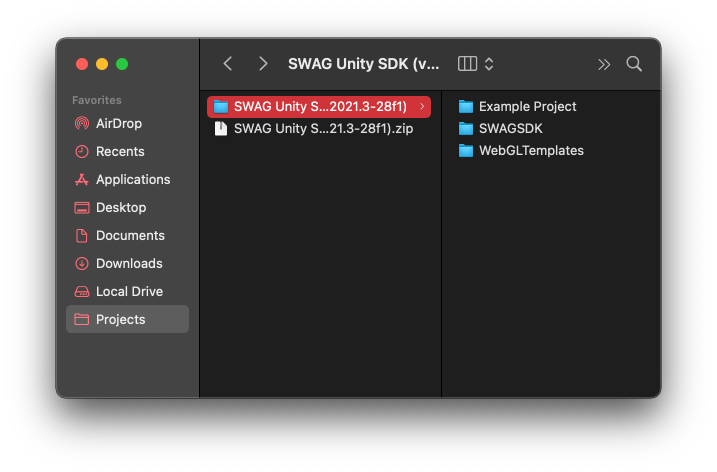
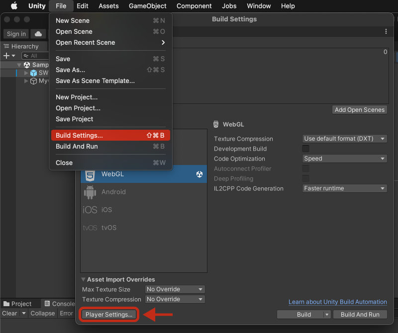
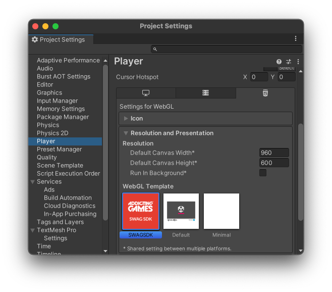
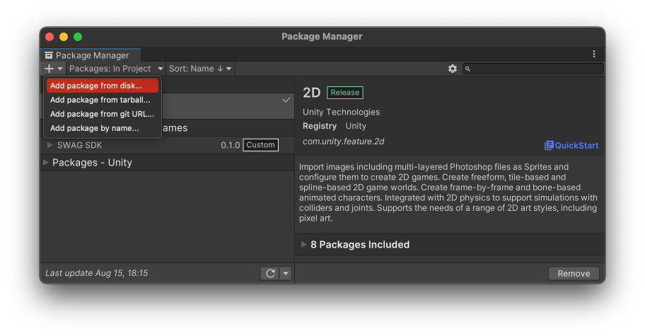
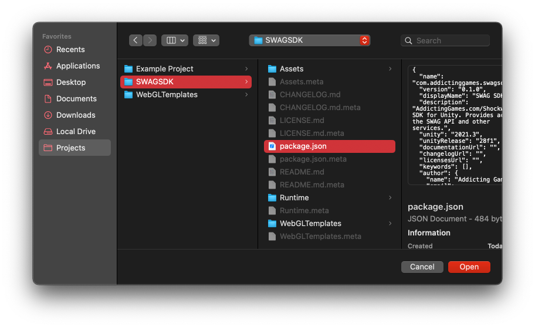
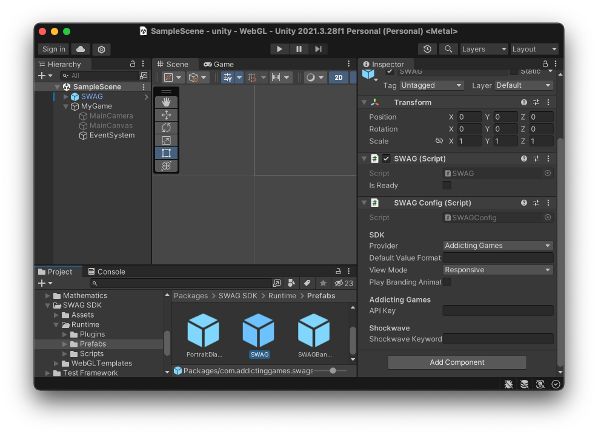

# Installation

This guide will help you install and configure the SWAG SDK for Unity.

::: info
If you're upgrading to the latest version of the SDK, please remove the existing WebGL Template and SWAG SDK package from your project first to avoid conflicts.
:::

## Download the SDK

[Download Unity SDK](https://github.com/TeachMeInc/SWAG-SDK/releases/latest)

Download the latest version of the SDK and unzip the folder somewhere outside of your project. The archive should contain three folders: `WebGLTemplates`, `SWAGSDK`, and `Example Project`.



::: info
If you're starting a new project from scratch using the `Example Project` you can skip to [here](/unity/installation#configuring-swag).
:::

## Install the WebGL Template

1. Copy the `WebGLTemplates` folder into your project's `Assets` folder.
2. Open your projects **Build Settings** (File -> Build Settings). With the **WebGL** platform selected, open the **Player Settings** dialog.
3. Under the **Settings for WebGL** panel, select the **SWAGSDK** template.





::: info
You can learn more about WebGL Templates, what they are, and how they work, [here](https://docs.unity3d.com/Manual/webgl-templates.html).
:::

## Install the SWAG package

1. Open the **Package Manager** (Window -> Package Manager) and from the **+** icon dropdown, choose to **Add package from disk**. 
2. Navigate to the `SWAGSDK` folder inside the folder you unzipped.
3. Select and open `package.json` from inside the `SWAGSDK` folder.






::: info
You can learn more about installing local packages [here](https://docs.unity3d.com/Manual/upm-ui-local.html).
:::

## Add the SWAG prefab to your scene

1. In your `Packages` folder, navigate to `SWAG SDK/Runtime/Prefabs`.
2. Drop the `SWAG` prefab into your scene. 



## Configuring SWAG

Once the `SWAG` prefab is added to your scene, click on the game object to configure the `SWAG` component in the editor panel.

::: info
You can view a full list of the configuration options available [here](/unity/script-reference/AddictingGames/SWAGConfig)
:::

### For AddictingGames.com

If your game is for [AddictingGames.com](https://www.addictinggames.com):

1. Choose the `Addicting Games` provider under the **SDK** header.
2. Enter your game's API Key under the **Addicting Games** header.

### For Shockwave.com<sup>*</sup>

If your game is for [Shockwave.com](https://www.shockwave.com):

1. Choose the `Shockwave` provider under the **SDK** header.
2. Enter your game's Shockwave Keyword under the **Shockwave** header.

<sup>*</sup> <small>__Please note that at this time, the Shockwave provider is unsupported, but will be available in a future update.__</small>

## Basic Usage

The SDK automatically handles initialization and authentication when the scene is loaded. In order to use many of the features of the SDK, you will need to first ensure that the SDK has finished loading and is in a ready state. 

There are two ways you can accomplish this:

1. By checking the `isReady` public field of the `SWAG` instance:

```C#
using UnityEngine;
using UnityEngine.EventSystems;
using AddictingGames;

public class OpenDialogButton : MonoBehaviour, IPointerClickHandler
{
    public void OnPointerClick (PointerEventData eventData)
    {
        var swag = SWAG.Instance;
        if (!swag.isReady) return;

        swag.Scores.ShowDialog(
          () => { Debug.Log("Dialog has closed"); }
        );
    }
}
```

2. By using the `OnReady` callback:

```C#
using UnityEngine;
using AddictingGames;

public class MyGameController : MonoBehaviour
{
    void Start ()
    {
        var swag = SWAG.Instance;

        swag.OnReady(() => {
            // Initialize the rest of your game
        });
    }
}
```

## Building Your Game

Once you've installed the SDK and verified that it works in Play Mode, you're ready to build your game. 

SWAG API calls are secured via [CORS](https://developer.mozilla.org/en-US/docs/Web/HTTP/CORS) and as such will only work properly when coming from `local.addictinggames.com` or `local.shockwave.com` domains on port `8888`. 

In order to test SWAG API integration in your built game locally, you will need to add these domains to your **HOSTS file** and run your game using an external web server. Each entry needs to be on its own line.

**Entries to add to your hosts file**

```
127.0.0.1 local.addictinggames.com
127.0.0.1 local.shockwave.com
```

::: info
You can find the HOSTS file at the following locations. You will need to be an administrator to edit the HOSTS file.

Windows: `C:\Windows\System32\Drivers\etc\hosts`

MacOS & Linux: `/etc/hosts`
:::

Now that you've added the HOSTS entries, you can build your game. From the **Build Settings** menu, making sure you have the **WebGL** platform selected, click the **Build** button and choose a folder.

Next, run an HTTP server in the folder where you built your game. The root of your HTTP server should be the the folder that contains your game's `index.html` file.

If you have [NodeJS](https://nodejs.org/en) installed, you can do this in one command using the [http-server](https://www.npmjs.com/package/http-server) node package:

**Run a local web server**
```
npx http-server ./ -p 8888
```

## Next Steps

Now that you've installed the SDK you're ready to start using it. 

- For a quick overview of the available features (with examples), check out our [Usage and Examples](/unity/usage-and-examples) guide.
- For a more comprehensive look at the features available, take a look at the [Script Reference guide for the SWAG C#](/unity/script-reference/AddictingGames/SWAG) class.