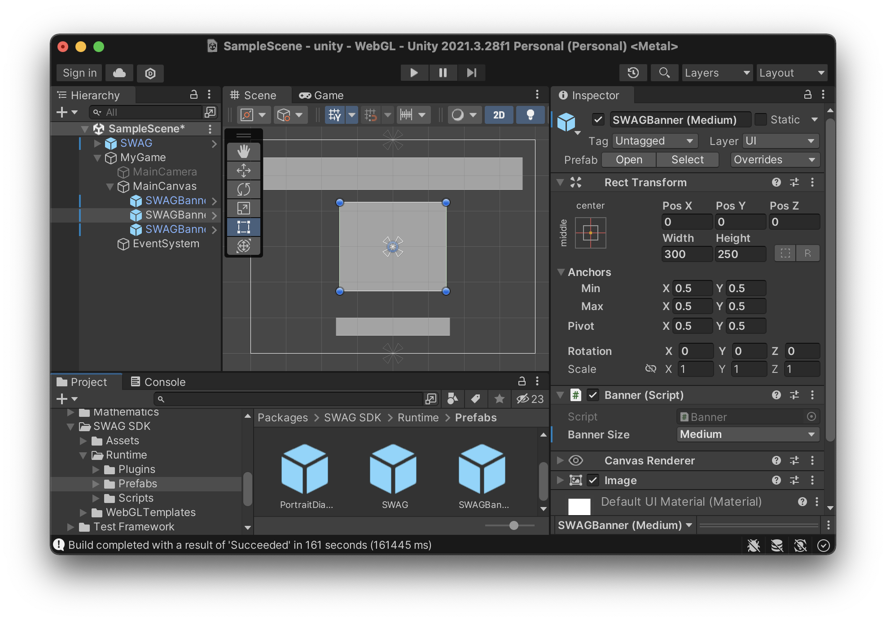

# Usage & Examples

## Achievements

### Show the achievements dialog

**Example**
```c#
SWAG.Instance.Achievements.ShowDialog(
    // Dialog closed callback
    () => { Debug.Log("Dialog closed."); }
    // Error callback
    (string error) => { Debug.Log(error); }
);
```
<small>Source: [Achievements.cs](/unity/script-reference/AddictingGames/Achievements/Achievements)</small>

### Record an achievement

**Example**
```c#
var key = "my_achievement_key";

SWAG.Instance.Achievements.currentUser.RecordAchievement(
    key,
    // Success callback
    () => { Debug.Log("Achievement recorded."); }
    // Error callback
    (string error) => { Debug.Log(error); }
);
```
<small>Source: [AchievementsCurrentUser.cs](/unity/script-reference/AddictingGames/Achievements/AchievementsCurrentUser)</small>

## Leaderboards

### Show the scores dialog

**Example**
```c#
SWAG.Instance.Scores.ShowDialog(
    // Dialog closed callback
    () => { Debug.Log("Dialog closed."); }
    // Error callback
    (string error) => { Debug.Log(error); }
);
```
<small>Source: [Scores.cs](/unity/script-reference/AddictingGames/Scores/Scores)</small>

### Record a score

**Example**
```c#
var levelKey = "level_0";
var score = 100f;

SWAG.Instance.Scores.currentUser.RecordScore(
    levelKey,
    score,
    // Success callback
    () => { Debug.Log("Score recorded."); }
    // Error callback
    (string error) => { Debug.Log(error); }
);
```
<small>Source: [ScoresCurrentUser.cs](/unity/script-reference/AddictingGames/Scores/ScoresCurrentUser)</small>

## Ads

### Play an advertisement

Play a full-screen video ad. The callback is executed when the ad is finished playing.

**Example**
```c#
SWAG.Instance.BeginAd(
    // Ad finished playing callback
    () => { Debug.Log("Ad done."); }
    // Error callback
    (string error) => { Debug.Log(error); }
);
```
<small>Source: [SWAG.cs](/unity/script-reference/AddictingGames/SWAG)</small>

### Banner ads

You can add Banner Ads to your game by using the Banner UI Component. 

1. In your `Packages` folder, navigate to `SWAG SDK/Runtime/Prefabs`.
2. Drop the `SWAGBanner` prefab into your scene's main canvas.
3. Configure the banner's position by adjusting it's RectTransform. You can also choose the size/type of banner from the SWAGBanner component's settings. 

When you build your game, these banners will be replaced with ads during runtime.



## Provider features

The provider API let you interact with the features of the host website (AddictingGames.com or Shockwave.com), such as showing the share dialog, or toggling full-screen mode.

### Show the share dialog

**Example**
```c#
SWAG.Instance.ShowShareDialog();
```
<small>Source: [SWAG.cs](/unity/script-reference/AddictingGames/SWAG)</small>

### Toggle fullscreen

**Example**
```c#
var isFullscreen = true;

SWAG.Instance.ToggleFullscreen(isFullscreen);
```
<small>Source: [SWAG.cs](/unity/script-reference/AddictingGames/SWAG)</small>

## User

### Show the login dialog

**Example**
```c#
SWAG.Instance.User.ShowLoginDialog(
    // Login success callback
    () => { Debug.Log("User logged in."); }
    // Dialog closed/login cancelled callback
    (string reason) => { Debug.Log(reason); }
);
```
<small>Source: [User.cs](/unity/script-reference/AddictingGames/User/User)</small>

### Get information about the current user

**Example**
```c#
var id = SWAG.Instance.User.id; // User's unique ID
var memberName = SWAG.Instance.User.memberName; // User's display name
var isGuest = SWAG.Instance.User.IsGuest(); // Logged in as guest or not
```
<small>Source: [User.cs](/unity/script-reference/AddictingGames/User/User)</small>

### Check if user is a subscriber

Checks to see if the user is a GamePass or Shockwave Unlimited subscriber.

**Example**
```c#
SWAG.Instance.User.IsSubscriber(
    // Success callback
    (bool isSubscriber) => { Debug.Log(isSubscriber); }
    // Error callback
    (string error) => { Debug.Log(error); }
);
```
<small>Source: [User.cs](/unity/script-reference/AddictingGames/User/User)</small>

### Set and get data for the user

Set and retrieve cloud save data for the current user. The data is stored in key-value pairs of strings.

**Example**
```c#
// Set data
var key = "any_key";
var value = "any_value";

SWAG.Instance.User.SetData(
    key,
    value,
    // Success callback
    () => { Debug.Log("User data saved."); }
    // Error callback
    (string error) => { Debug.Log(error); }
);

// Get data
SWAG.Instance.User.GetData(
    key,
    // Success callback
    (List<UserData> data) => { Debug.Log("User data retrieved."); }
    // Error callback
    (string error) => { Debug.Log(error); }
);
```
<small>Source: [User.cs](/unity/script-reference/AddictingGames/User/User), [UserData.cs](/unity/script-reference/AddictingGames/User/UserData)</small>
